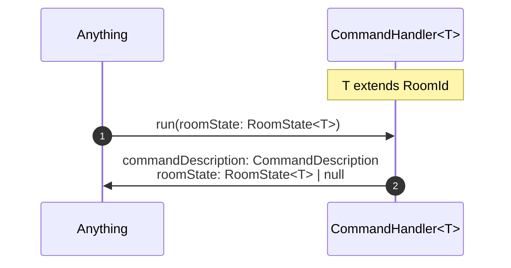

# CommandHandler

A CommandHandler determines the next [RoomState](../data/roomState.md) given the current RoomState
and the [CommandDescription](../data/commandDescription.md) of the current [Command](../data/command.md).

If it returns a RoomState, the new RoomState will have the same type as the input RooomState.

If the player leaves the current [Room](../data/room.md), then the CommandHandler returns `null` for the RoomState.

## DefaultCommandHandler

The DefaultCommandHandler is run when the `default` command is run. It returns the input RoomState and a `null` CommandDescription.

## InvalidCommandHandler

The InvalidCommandHandler runs when an invalid Command is invoked.
It returns the input RoomState and the [InvalidCommandDescription](../data/commandDescription#invalidcommanddescription)

