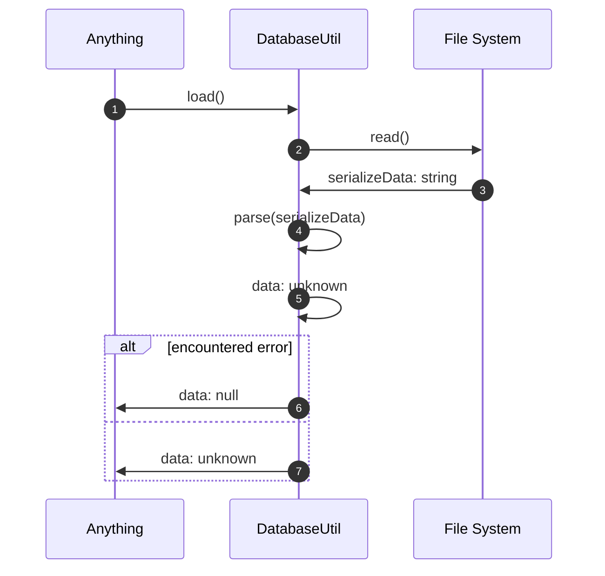
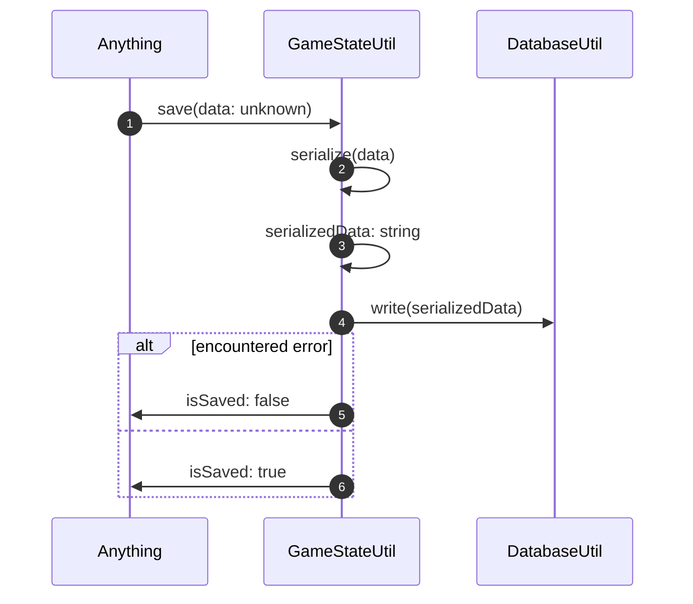

# DatabaseUtil

The [DatabaseUtil](../src/utils/databaseUtil.ts) abstracts
writing and reading to the file system,
as well as parsing and serializing the game data.

## Load

```mermaid
sequenceDiagram
  autonumber
  participant A as Anything
  participant D as DatabaseUtil
  participant F as File System

  A ->> D: load()
  D ->> F: read()
  F ->> D: serializeData: string

  D ->> D: parse(serializeData)
  D ->> D: data: unknown

  alt encountered error
    D ->> A: data: null
  else
    D ->> A: data: unknown
  end
```

## Save

```mermaid
sequenceDiagram
  autonumber
  participant A as Anything
  participant D as GameStateUtil
  participant F as DatabaseUtil

  A ->> D: save(data: unknown)

  D ->> D: serialize(data)
  D ->> D: serializedData: string

  D ->> F: write(serializedData)

  alt encountered error
    D ->> A: isSaved: false
  else
    D ->> A: isSaved: true
  end
```
