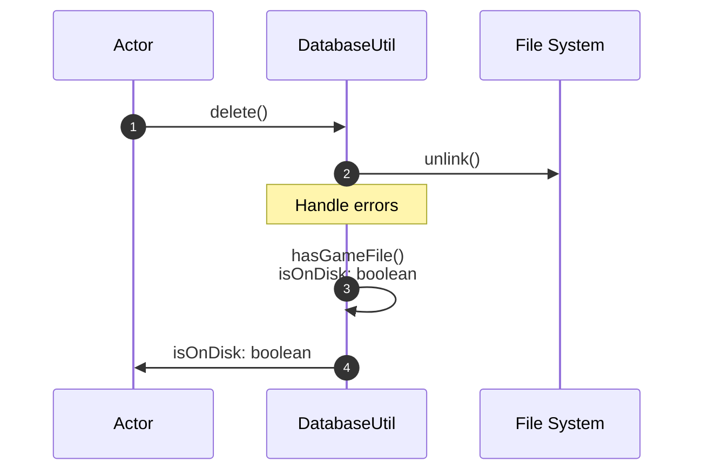
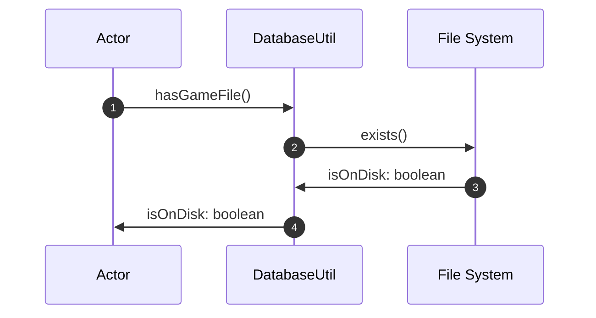
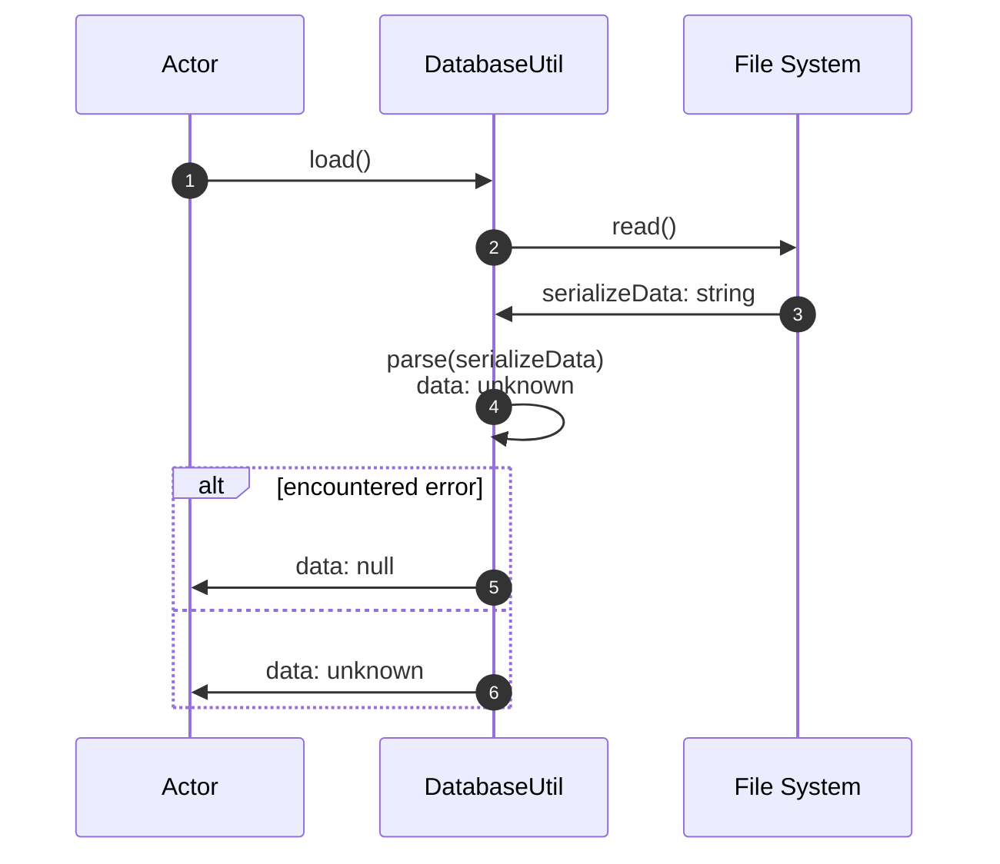
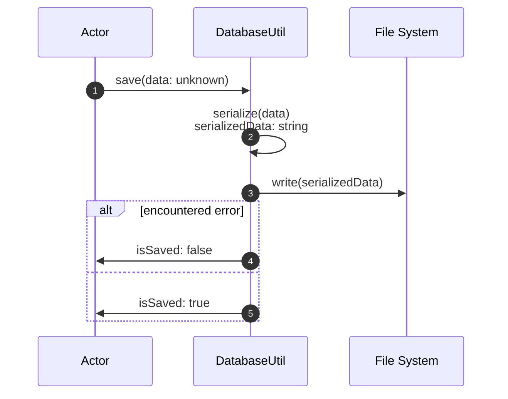

# DatabaseUtil

The [DatabaseUtil](../src/utils/databaseUtil.ts) abstracts
writing and reading to the file system,
as well as parsing and serializing the game data.

For now it is assumed that there is only one save file.

## Delete

## HasGameFile

## Load

## Save

