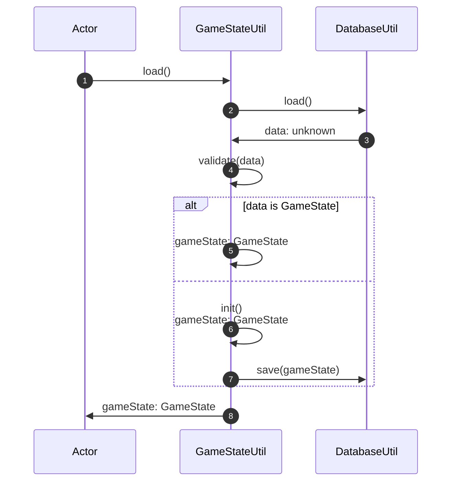
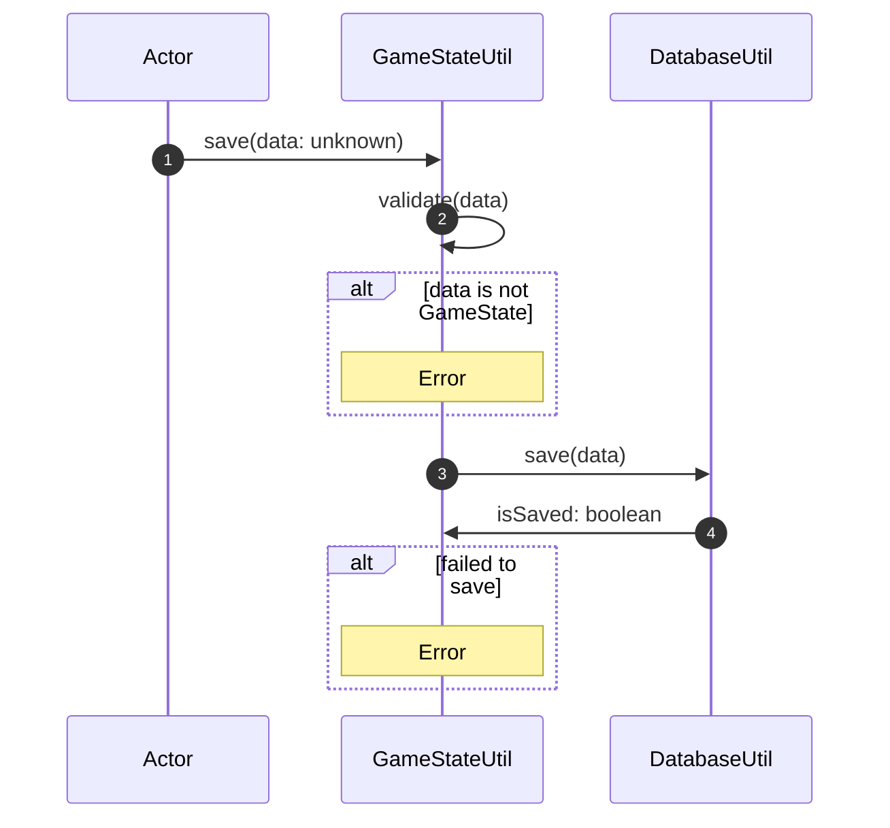

# GameStateUtil

The [GameStateUtil](../../src/utils/gameStateUtil.ts) enforces a valid [GameState](./gameState.md)
when loading and saving data via the [DatabaseUtil](./databaseUtil.md).

## Load

## Save

