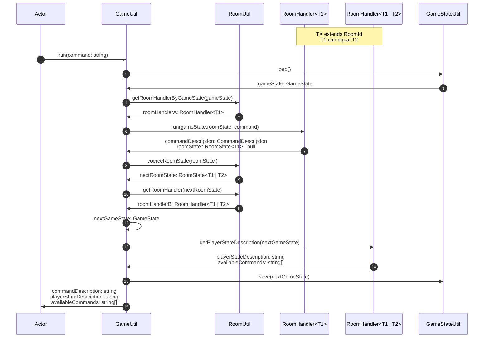

# GameUtil

The [GameUtil](../src/utils/gameUtil.ts) orchestrates
loading the [GameState](../data/GameState),
aggregating the [CommandDescription](../data/commandDescription.md),
[PlayerStateDescription](../data/playerStateDescription.md)
and available [Command](../data/command.md)s,
and saving the new game state.

It interacts with the [GameStateUtil](./gameStateUtil.md) to save and load the GameState,
the [RoomUtil](./roomUtil.md) to run the Command and retrieve
the next [RoomHandler](./roomHandler.md), and the RoomHandler to get the PlayerStateDescription and available Commands.

## Run

