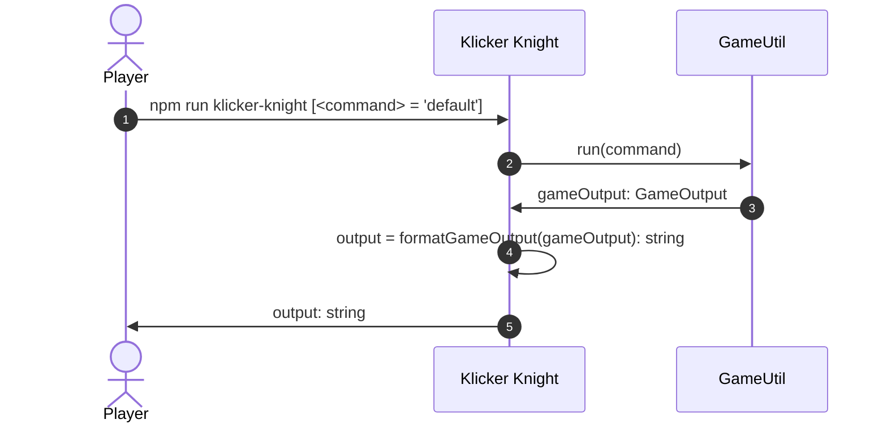

# Klicker Knight

[klickerKnight.ts](../../src/klickerKnight.ts) represents the entry point to the game.
It abstracts the string input and output from the [GameUtil](./gameUtil.md).

## npm run klicker-knight

