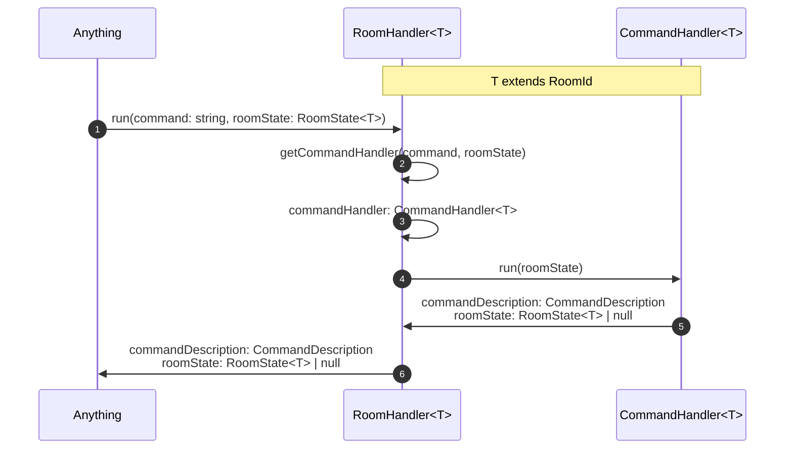

# RoomHandler

A RoomHandler models the state machine of a [Room](../data/room.md). Every RoomHandler corresponds to a unique [room id](../data/roomId.md).
A RoomHandler abstracts finding and running the [CommandHandler](./commandHandler.md)
that corresponds to a given [Command](../data/command.md) and [RoomState](../data/roomState.md).

If the Command is the default Command, the RoomHandler runs the [DefaultCommandHandler](./commandHandler.md#defaultcommandhandler).

If the Command is invalid for the given RoomState, the RoomHandler runs a special [InvalidCommandHandler](./commandHandler.md#invalidcommandhandler)

## Run

