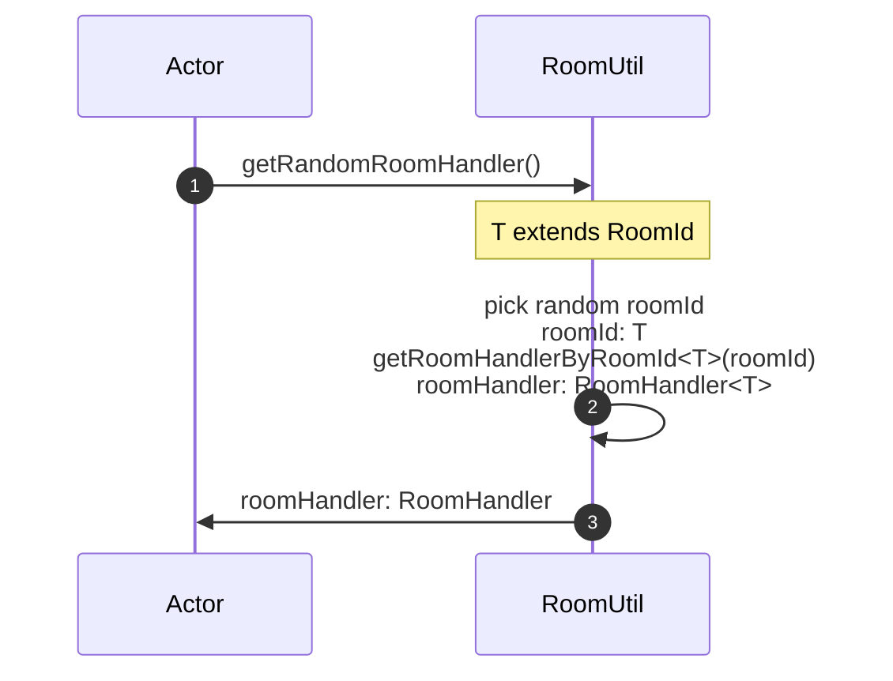
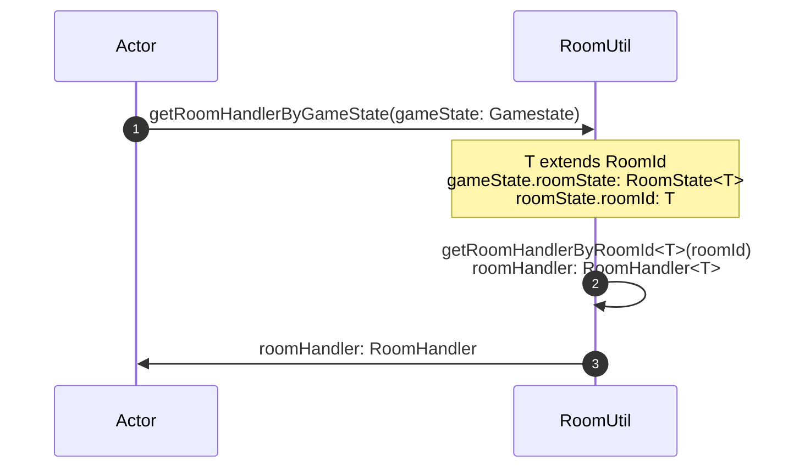
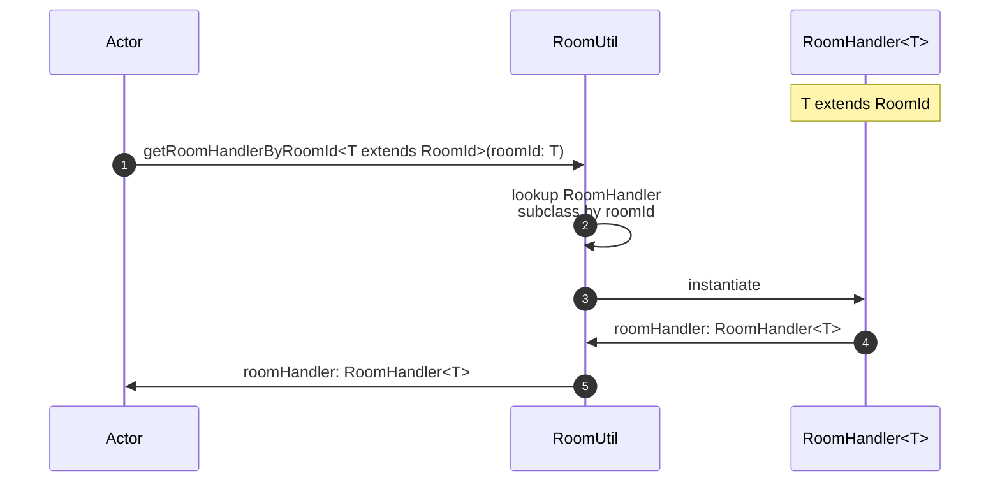
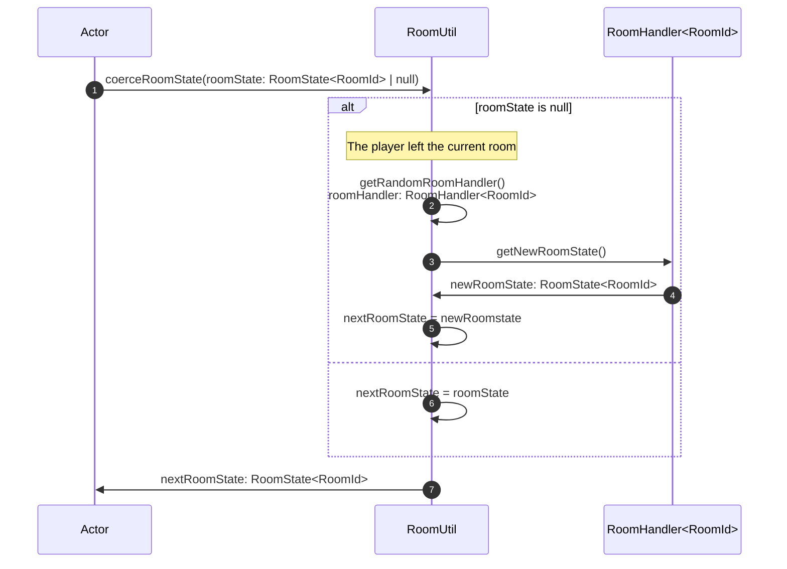

# RoomUtil

The [RoomUtil](../src/utils/roomUtil.ts) abstracts selecting a random [RoomHandler](./roomHandler.md),
or selecting a RoomHandler by [GameState](../data/GameState.md) or [room id](../data/RoomId.md)

It also abstracts coercing a nullable [RoomState](../data/roomState.md) which is used by the [GameUtil](./gameUtil.md)
to make sure that there is a new valid RoomState after a player runs a [Command](../data/command.md).

## GetRandomRoomHandler

## GetRoomHandlerByGameState

## GetRoomHandlerByRoomId

## CoerceRoomState

