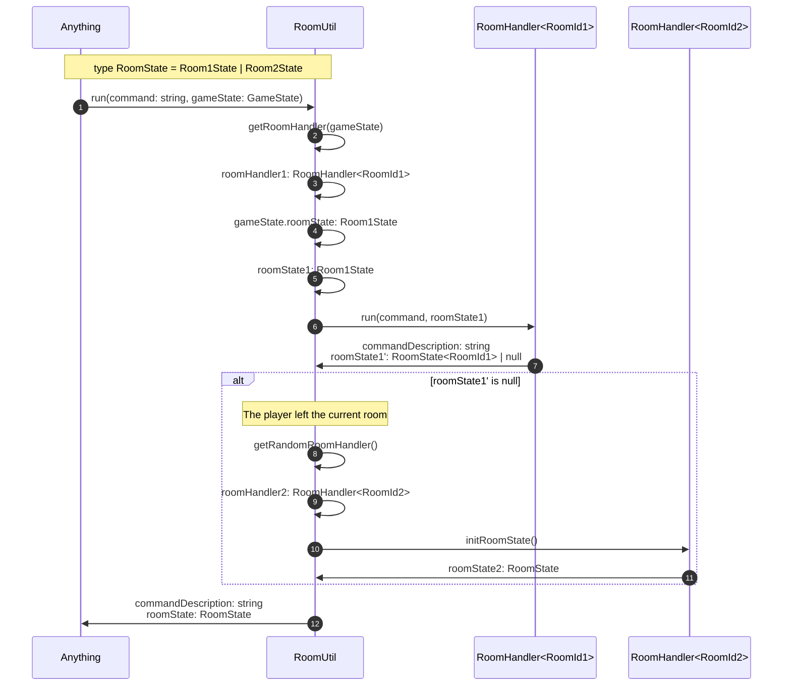

# RoomUtil

The [RoomUtil](../src/utils/roomUtil.ts) abstracts selecting the [RoomHandler](./roomHandler.md) for a given [GameState](../data/GameState.md),
passing the [RoomState](../data/roomState.md) to the current RoomHandler,
and finding a new GameState when the player leaves the current [Room](../data/Room.md).

Since the RoomUtil has to handle the player leaving the room,
it also has to aggregate  [CommandDescription](../data/commandDescription.md) along with the new GameState.

