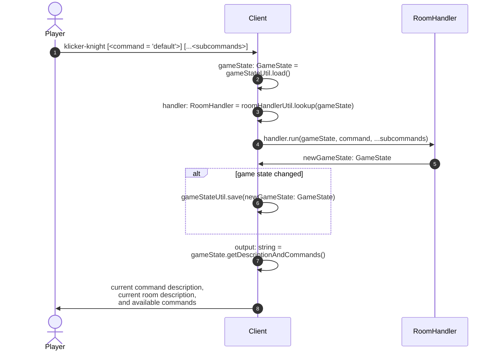

# Client

The client is the entry point of the application along with some of the top level logic that runs on each command.

See the [Data Abstraction](./dataAbstraction.md), [RoomHandlerUtil](./roomHandlerUtil.md) and [RoomHandler](./roomHandler.md)
diagrams for more details on their behavior.

