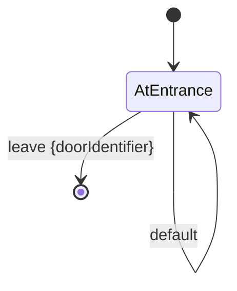

# Room

A Room is an abstract concept that the player exists in and interacts with.

- A Room has a unique [room type](./roomType.md)
- An instance of a Room is a [RoomState](./roomState.md)
- A Room is defined by a state machine
  - states are [PlayerState](./playerState.md)s
  - transitions are [Command](./command.md)s
  - the state machine is modeled by a [RoomHandler](../architecture/RoomHandler.md)
- A Room has one entrance ([Door](./door.md))
- A Room has one or more exits (Doors)
- All entrances are locked and cannot be exits

## Default Room Behavior

### PlayerState

- **AtEntrance**: The initial state of a room. Specific [room doc](../rooms/) should specify what the player sees.

### Command

- **default**: Specific room docs should specify what the player sees at the entrance
- **leave \<doorIdentifier\>**: The player wants to leave the room via the specified door.
Rooms with one door may have a default `doorIdentifier`.
The `doorIdentifier` can be  used to perform special behavior before leaving the room.

## State Diagram

