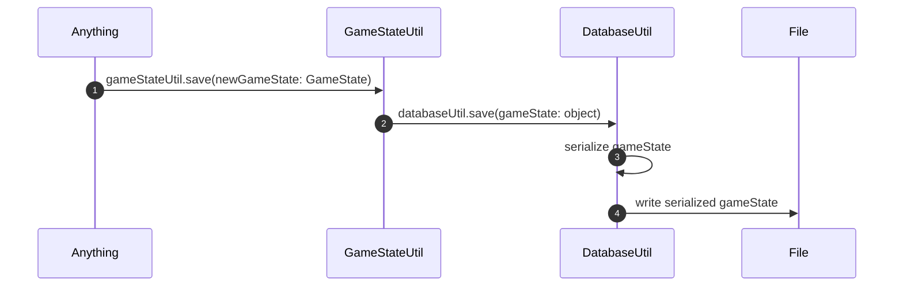
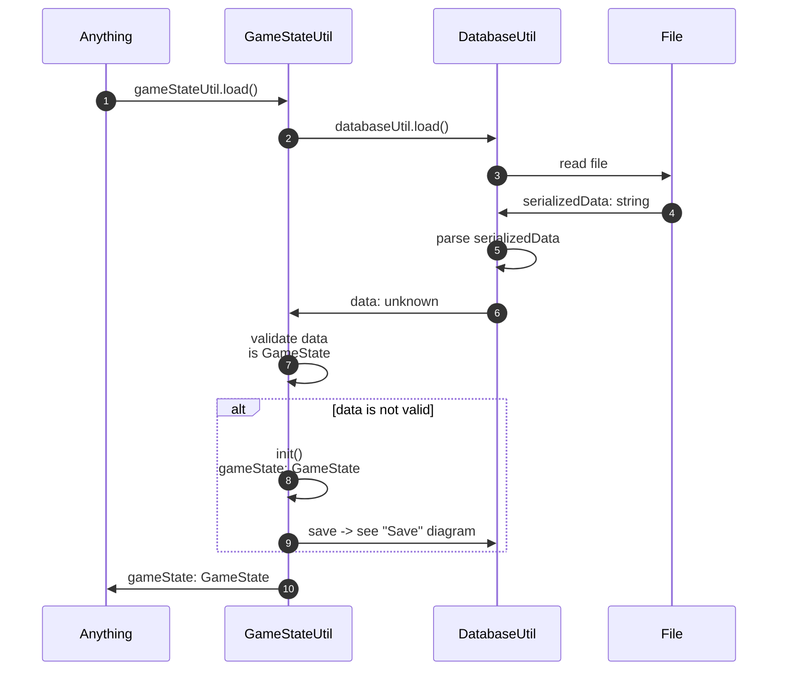

# Data Abstraction

The GameStateUtil abstracts the behavior of the DatabaseUtil and the underlying JSON file where the game state is stored.

See the [client](./client.md) diagram for more information on how `gameStateUtil` is invoked.

## Save

## Load

