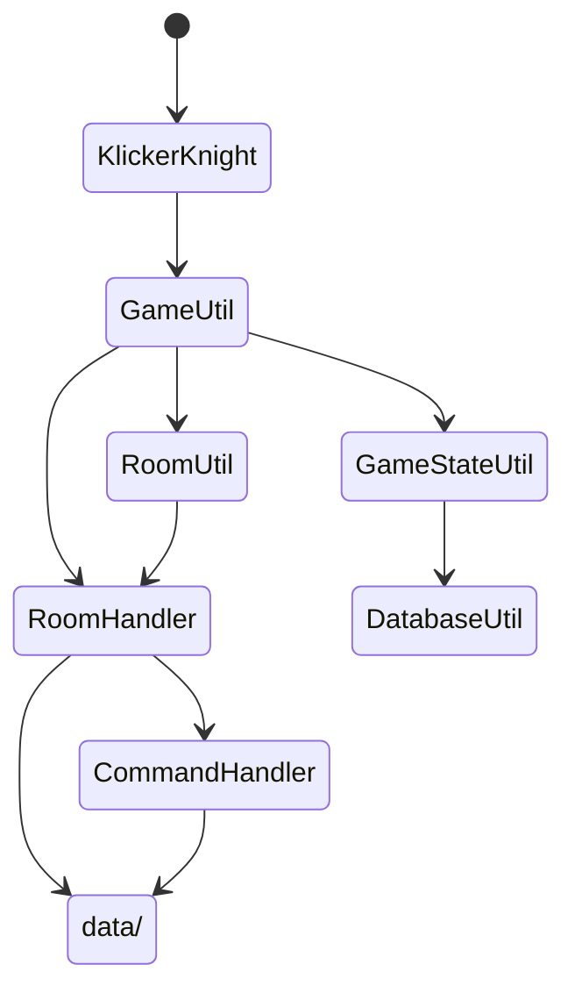
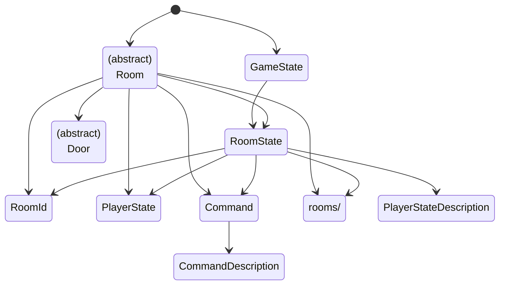

# Docs

[All docs](./)

## Knowledge Hierarchies

### [Architecture/](./architecture/)

```mermaid
stateDiagram-v2
  [*] --> KlickerKnight

  KlickerKnight --> GameUtil

  GameUtil --> GameStateUtil
  GameUtil --> RoomUtil
  GameUtil --> RoomHandler

  GameStateUtil --> DatabaseUtil

  RoomUtil --> RoomHandler

  RoomHandler --> CommandHandler
  RoomHandler --> data/

  CommandHandler --> data/
```

### [Data/](./data/)

```mermaid
stateDiagram-v2
  [*] --> GameState

  GameState --> RoomState

  [*] --> (abstract)<br>Room

  (abstract)<br>Room --> (abstract)<br>Door
  (abstract)<br>Room --> RoomId
  (abstract)<br>Room --> RoomState
  (abstract)<br>Room --> PlayerState
  (abstract)<br>Room --> Command
  (abstract)<br>Room --> rooms/

  RoomState --> RoomId
  RoomState --> PlayerState
  RoomState --> PlayerStateDescription
  RoomState --> Command
  RoomState --> rooms/

  Command --> CommandDescription
```

### [Rooms/](./room/)

(See previous diagram)
