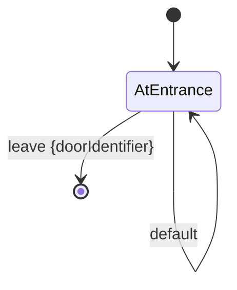

# RoomHandler

A RoomHandler models the different states and state transitions of a [room](./room.md).
RoomHandler is an abstract class, so specific room handlers are documented in [./roomHandlers/](./roomHandlers/).

The player is always in a known room, and in the context of that room,
the player is always in a known room state.
When a player triggers an action via a command, the game can report the
description of the action and the description of the resulting room state.
The player invokes the following to trigger a state transition:

```bash
klicker-knight <command> [...<subcommands>]
```

The default command is `default`.

See the [client](./client) diagram for more information on how a RoomHandler is invoked with a command and subcommands.

## States

- **AtEntrance**: The initial state of a room. Specific room handler docs should specify what the player sees at the entrance.

## Transitions

- **default**: Specific room handlers should specify what the player sees at the entrance
- **leave \<doorIdentifier\>**: The player wants to leave the room via the specified door.
Rooms with one door may have a default `doorIdentifier`.
The `doorIdentifier` can be  used to perform special behavior before leaving the room.
Leaving is implemented by setting or randomizing the room id of the current game state.

## State Diagram


