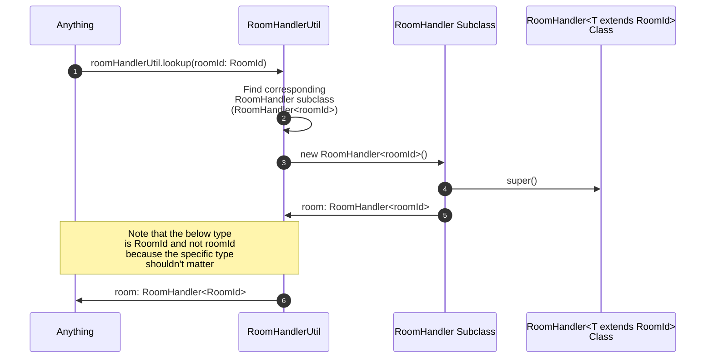

# RoomHandlerUtil

The roomHandlerUtil abstracts looking up the [RoomHandler](./roomHandler.md)
for a specific [Room](./room.md) based on a `roomId`.
`roomId` is of type `RoomId` which is an enum or string union.

See the [client](./client.md) diagram to see how the roomHandlerUtil is invoked.

