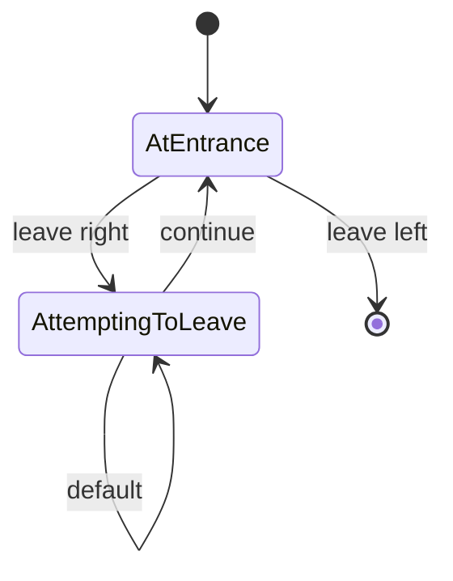

# Decision Room

A room with two doors. Taking the door on the left moves the player to the next random room.
Taking the door on the right takes the player back to the same room.

## States

- **AtEntrance**: The player is in a room two doors. The game should indicate that the player will take the door on the left
- **AttemptingToLeave**: The player is walking down a long hallway and is about to round a corner.

## Transitions

- **leave <'left' | 'right'>**: The player leaves the room via the `doorIdentifier` door
- **continue**: The player rounds the corner of the long hallway

## Diagram

