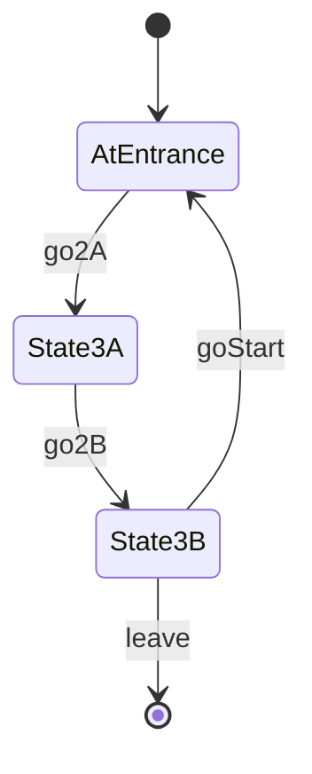

# Example Room 3

- **roomType**: exampleRoom3

A room that has state besides the PlayerState.

This room will go away when other rooms are implemented.

## PlayerState

- **AtEntrance**: You are at the entrance of example room 3 and have completed n laps
- **State3A**: You are in state 3A
- **State3B**: You are in state 3B

## RoomState

- **laps**: The number of times the player re-visits the `AtEntrance` PlayerState after moving to `State3A`

## Commands

- **leave**: You leave example room 3
- **go3A**: You move to state 3A
- **go3B**: You move to state 3B
- **goStart**: You move back to the entrance

## Diagram

