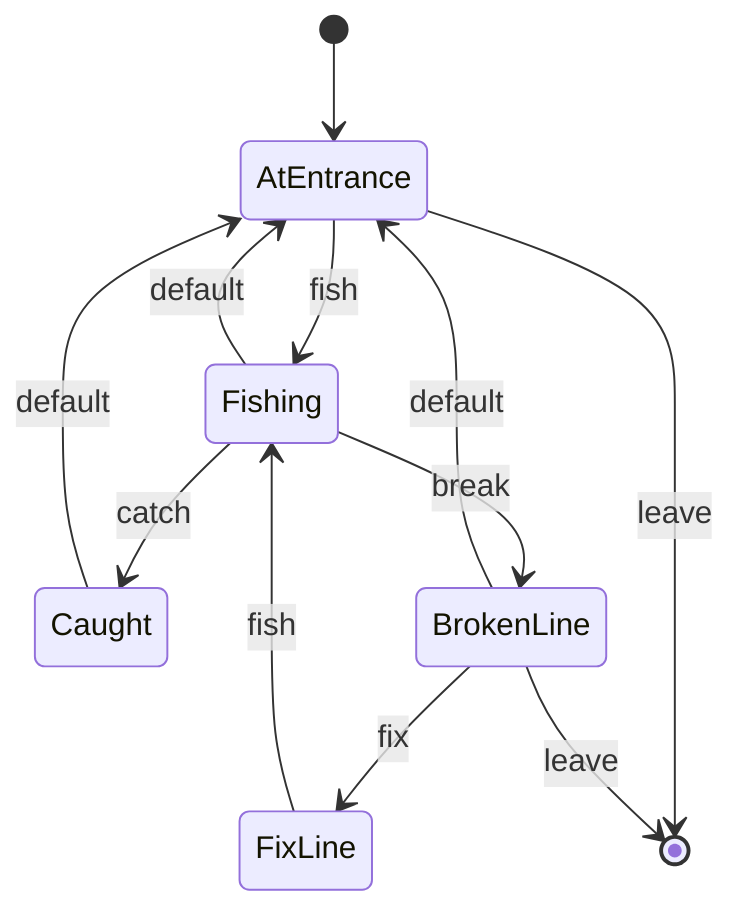

# Fishing Room

A room with a beach and a boat dock. The player can fish from dock or leave. Fishing may result in catching a fish.

## States

- **AtEntrance**: The player is on a dock with a fishing pole
- **Fishing**: The player casts their fishing line in hopes to find a fish
- **Caught**: The player now has a fish
- **BrokenLine**: The player has a broken their fishing line and the fish got away
- **FixLine**: The player can fix their broken line to fish again

## Transitions

- **leave**: The player leaves through the only available door
- **fish**: The player casts their fishing line
- **catch**: The player has caught a fish
- **break**: The player lost the fish
- **fix**: The player fixs their fishing pole so they can fish again

## Diagram

