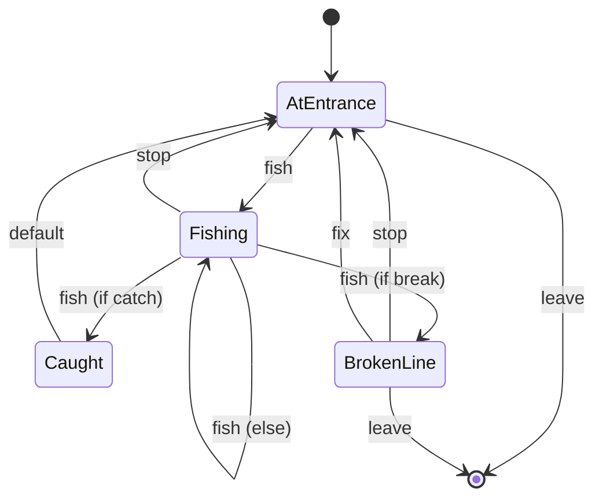

# Fishing Room

A room with a beach and a boat dock. The player can fish from dock or leave. Fishing may result in catching a fish.

## States

- **AtEntrance**: The player is on a dock with a fishing pole. Total number of fish caught is X so far!
- **Fishing**: Hopefully the fish are hungry today.
- **Caught**: Congratulations!!! The player caught a fish!!!
- **BrokenLine**: The player has a broken their fishing line and the fish got away.

## Transitions

- **leave**: The player leaves through the only available door. Total number of fish caught is X.
- **fish**: The player casts their fishing line.
- **fix**: The player fixs their fishing pole so they can fish again.
- **stop**: The player stops fishing.

## Diagram

