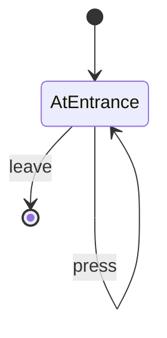

# Button Room

- **roomType**: buttonRoom

A room with a single button that you can press.

## PlayerState

- **AtEntrance**: You are at the entrance of the button room.
  You have pressed the button X number of times.
  Do you want to press it again?

## RoomState

- **presses**: The number of times you have pressed the button.

## Commands

- **leave**: You leave button room having pressed the button X number of times.
- **press**: You press the button!

## Diagram

