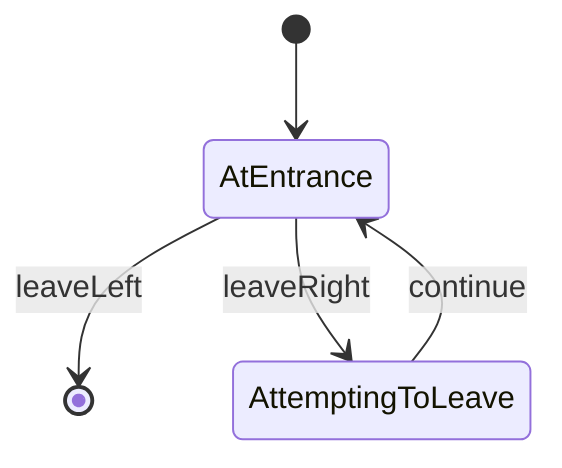

# Decision Room

- **roomType**: decisionRoom

A room with two doors. Taking the door on the left moves the player to the next random room.
Taking the door on the right takes the player back to the same room.

## PlayerStates

- **AtEntrance**: You see two doors and decide you should take the door on the left.
- **AttemptingToLeave**: You are walking down a long hallway. There is a sharp turn to the left up ahead.

## RoomState

- **isSheeple**: A boolean indicating if the player never took the door on the right

## Commands

- **leaveLeft**:
  - isSheeple: As decided, you exit via the door on the left.
  - !isSheeple: As originally intended, you exit via the door on the left.
- **leaveRight**:
  - isSheeple: Interestingly enough, you change your mind and exit via the door on the right.
  - !isSheeple: Despite your better judgement, you continue through the door on the right.
- **continue**: You round the corner of the long hallway.

## Diagram

