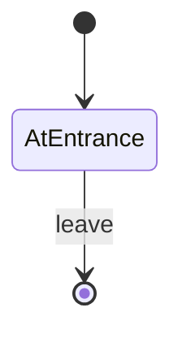

# Example Room 1

- **roomType**: exampleRoom1

The simplest room you can have. You can be in the room, or you can leave.

This room will go away when other rooms are implemented.

## PlayerState

- **AtEntrance**: You are in example room 1.

## Commands

- **leave**: You leave example room 1.

## Diagram

