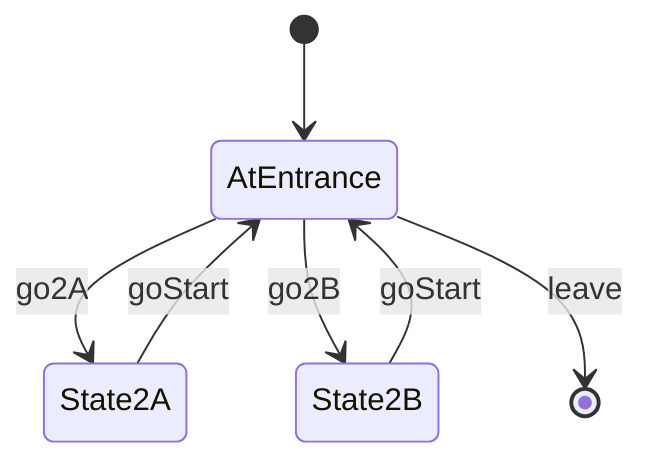

# Example Room 2

- **roomType**: exampleRoom2

A room with more than one state.

This room will go away when other rooms are implemented.

## PlayerState

- **AtEntrance**: You are at the entrance of example room 2
- **State2A**: You are in state 2A
- **State2B**: You are in state 2B

## Commands

- **leave**: You leave example room 2
- **go2A**: You move to state 2A
- **go2B**: You move to state 2B
- **goStart**: You move back to the entrance

## Diagram

