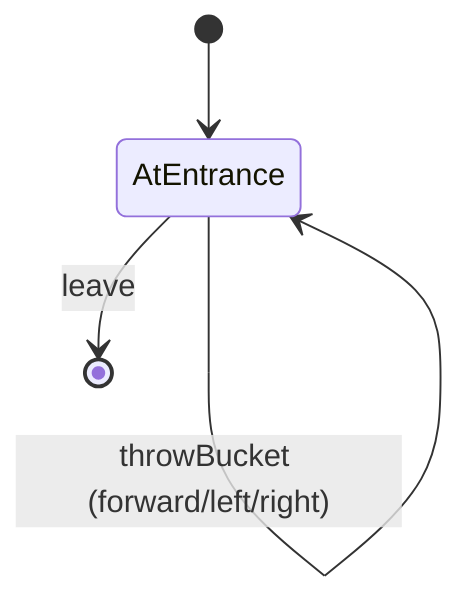

# Fire Room

A room with three different paths.
One path leads to a person, the second path leads to a item and the third path leads nowhere.
Each path is on fire but the player is given two buckets of water.
The goal of this room is to save the person.

## PlayerStates

- **AtEntrance**: You are in the main room with X buckets of water.
  There is a fire to your left/right/in front of you.
  You have/haven't saved the person and you have/haven't retrieved the item.

## RoomState

- **waterBuckets**: The number of buckets that still have water in them.
- **fireForward**: Boolean for if there is a fire in front of you.
- **fireLeft**: Boolean for if there is a fire to the left of you.
- **fireRight**: Boolean for if there is a fire to the right of you.
- **personSaved**: Boolean for if the person was saved.
- **itemRetrieved**: Boolean for if the item was found.

## Commands

- **leave**: You leave through the only available door.
  X of the fires were put out and there was X number of water buckets left.
  The person was/wasn't saved and you did/didn't find the item.
- **throwBucket**: You throw the bucket of water
  - **forward (default)**: in front of you.
  - **left**: to the left of you
  - **right**: to the right of you.

## Diagram

