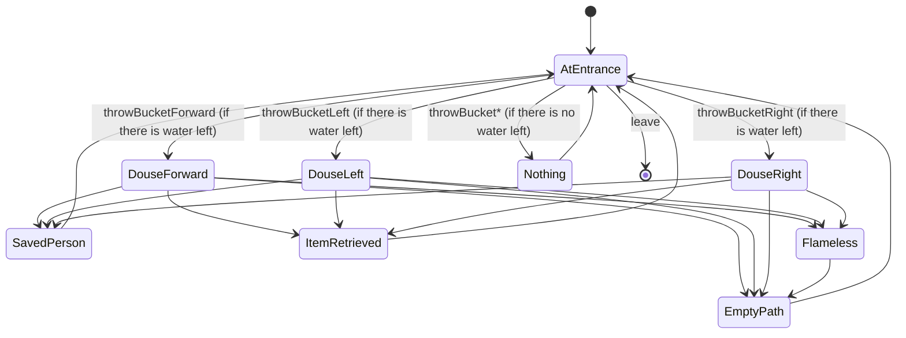

# Fire Room

A room with three different paths.
One path leads to a person, the second path leads to a item and the third path leads nowhere.
Each path is on fire but the player is given two buckets of water.
The goal of this room is to save the person.

## PlayerStates

- **AtEntrance**: The player is in the main room with x buckets of water.
- **DouseForward**: The water from the bucket puts out the fire in front of the player.
- **DouseLeft**: The water from the bucket puts out the fire to the left of the player.
- **DouseRight**: The water from the bucket puts out the fire to the right of the player.
- **Nothing**: There is no water left. You did nothing.
- **SavedPerson**: Congratulations!!! The player saved the person!!!
- **ItemRetrieved**: Congratulations!!! The player got a cool item!!!
- **EmptyPath**: There is nothing here. Better luck next time.
- **Flameless**: You already put out the fire here...

## Commands

- **leave**: The player leaves through the only available door.
- **throwBucketForward**: The player throws the bucket of water.
- **throwBucketLeft**: The player throws the bucket of water.
- **throwBucketRight**: The player throws the bucket of water.

## Diagram

