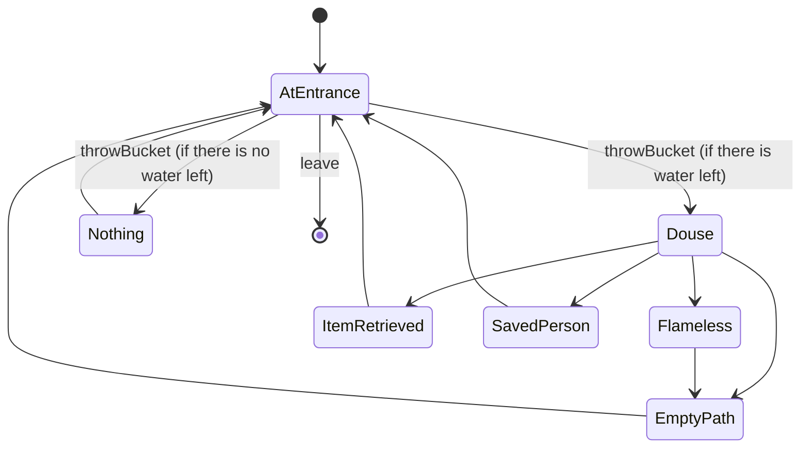

# Fire Room

A room with three different paths.
One path leads to a person, the second path leads to a item and the third path leads nowhere.
Each path is on fire but the player is given two buckets of water.
The goal of this room is to save the person.

## PlayerStates

- **AtEntrance**: You are in the main room with x buckets of water.
- **Douse**: The water from the bucket puts out the fire.
- **Nothing**: There is no water left. You did nothing.
- **SavedPerson**: Congratulations!!! You saved the person!!!
- **ItemRetrieved**: Congratulations!!! You got a cool item!!!
- **EmptyPath**: There is nothing here. Better luck next time.
- **Flameless**: You already put out the fire here...

## RoomState

- **waterBuckets**: The number of buckets that still have water in them.
- **fireForward**: Boolean for if there is a fire in front of you.
- **fireLeft**: Boolean for if there is a fire to the left of you.
- **fireRight**: Boolean for if there is a fire to the right of you.

## Commands

- **leave**: You leave through the only available door.
- **throwBucket**: You throw the bucket of water
  - **forward (default)**: in front of you.
  - **left**: to the left of you
  - **right**: to the right of you.

## Diagram

