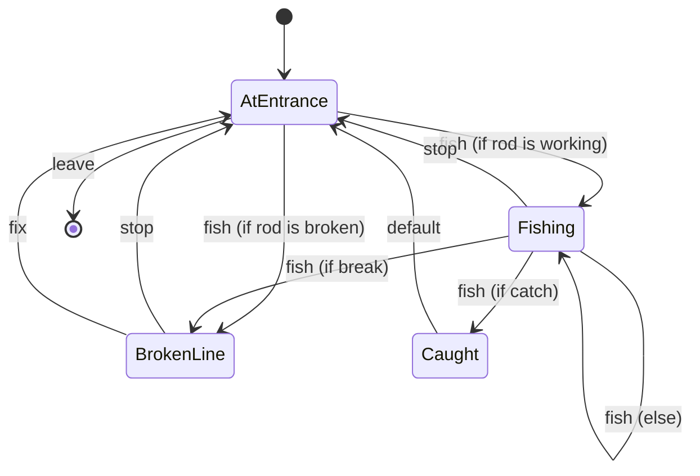

# Fishing Room

- **roomType**: fishingRoom

A room with a beach and a boat dock. You can fish from dock or leave. Fishing may result in catching a fish.

## PlayerStates

- **AtEntrance**: You are on a dock with a working/broken fishing pole. Total number of fish caught is X so far!
- **Fishing**: Hopefully the fish are hungry today.
- **Caught**: Congratulations!!! You caught a fish!!!
- **BrokenLine**: You have a broken fishing line and the fish got away.

## Commands

- **leave**: You leaves through the only available door. Total number of fish caught is X.
- **fish**: You casts your fishing line.
- **fix**: You fix your fishing pole so you can fish again.
- **stop**: You stops fishing.

## Diagram

