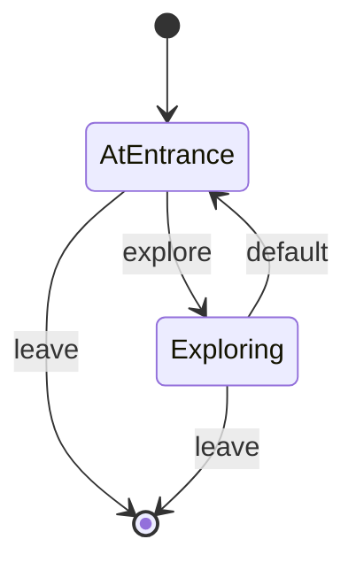

# Roomception

A room with a closed off room inside. The main room is basically a hallway that wraps around an innner room.
The player can explore the main room (the hallway) or enter the inner room (which constitutes **leaving** the main room).

## PlayerState

- **AtEntrance**: The player is in a room with a room inside
- **Exploring**: The player confirms that there is a room in this room and nothing else

## Commands

- **leave**: The player leaves through the only available door
- **explore**: The player wanders the hallway

## Diagram

