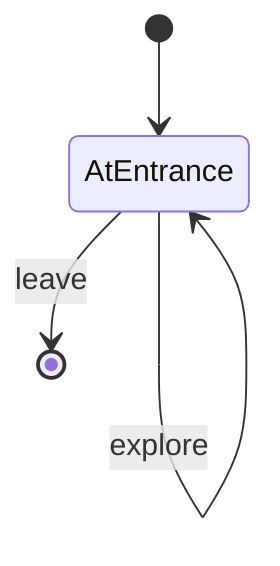

# Roomception Room

- **roomType**: roomceptionRoom

A room with a closed off room inside. The main room is basically a hallway that wraps around an innner room.
The player can explore the main room (the hallway) or enter the inner room (which constitutes **leaving** the main room).

## PlayerStates

- **AtEntrance**: You are in a hallway with a lone door.

## Commands

- **explore**: You wander the lengths of the hallway only to return to where you started.
- **leave**: You leave through the only available door.

## Diagrams

